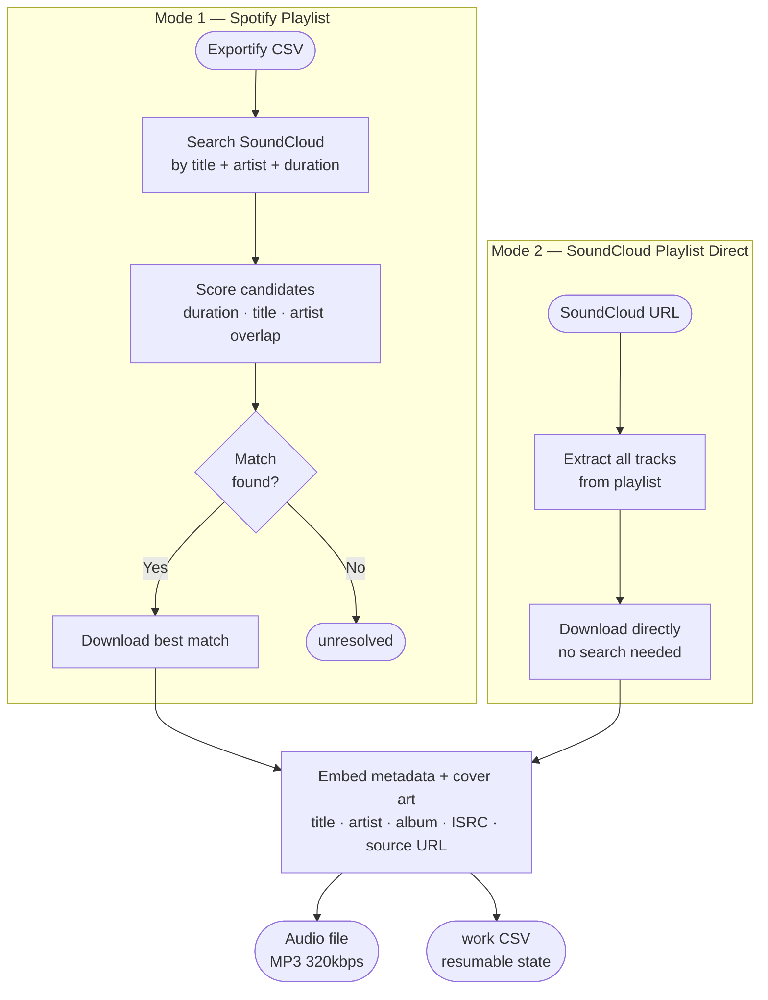

# cratedigg

> Source your Spotify playlists from SoundCloud — higher quality, your library, your files.

**cratedigg** is named after *crate digging*, the DJ practice of hunting through record crates for rare, high-quality tracks. The tool does the same thing digitally: takes your Spotify playlist and finds the best available version of each track on SoundCloud, downloading it as MP3 320kbps for your DJ library. YouTube serves as a fallback for anything SoundCloud cannot deliver.

cratedigg takes an Exportify CSV (your Spotify playlist) and downloads each track from SoundCloud as MP3 320kbps. With SoundCloud Go+, it sources from 256kbps AAC or the artist's original upload before transcoding. Tracks unavailable on SoundCloud (DRM, deleted, rate-limited) fall back to YouTube automatically. It can also download SoundCloud playlists and sets directly without any Spotify CSV at all.

> **SoundCloud Go+ is strongly recommended.** Without it, SoundCloud serves 128kbps MP3 — no better than a YouTube rip. Go+ unlocks 256kbps AAC and original-quality uploads. See [SoundCloud Go+](https://soundcloud.com/go).

---

## How It Works

Two input modes, one download engine:



**Key behaviors:**
- **MP3 320kbps by default** — all downloads are transcoded to MP3 320 for universal DJ hardware compatibility. Use `--native-format` to keep the raw stream (m4a/webm).
- **Resumable** — every row's state is written to a `_work.csv`. Interrupted runs pick up exactly where they left off.
- **Serial by default** — runs one track at a time (`--workers 1`) to avoid SoundCloud 429 rate limits. Use `--workers 2` only if you're not hitting rate limits.
- **YouTube fallback** — tracks unavailable on SoundCloud (DRM, deleted, private, or rate-limited) are automatically retried on YouTube. Fallback tracks are marked `[yt]` in the log.
- **Source URL embedded** — the SoundCloud track link is written into the audio file's `WOAS` ID3 tag and the work CSV `source_url` column.

---

## Quick Start

**Prerequisites:** Python 3.10+, ffmpeg on PATH, [SoundCloud Go+](https://soundcloud.com/go) subscription

```powershell
# 1. Install dependencies
pip install -r requirements.txt

# 2. Install ffmpeg (Windows, one-time)
winget install Gyan.FFmpeg
# Restart your terminal after install, then verify: ffmpeg -version

# 3. Export your Spotify playlist (see below), then run
python main.py input/my_playlist.csv
```

---

## Getting Your Spotify CSV

cratedigg uses [Exportify](https://exportify.app) to get your Spotify playlist data.

1. Go to **[exportify.app](https://exportify.app)**
2. Click **Log in with Spotify** and authorize the app
3. Your playlists appear as a list — find the one you want
4. Click **Export** next to it → a `.csv` file downloads automatically
5. Place the `.csv` file in the `input/` folder — cratedigg will find it automatically

> **Tip:** You can export multiple playlists and put them all in `input/`, then run `python main.py --csv-folder input/` to process them all in one go.

---

### Spotify playlist (via Exportify CSV)

```powershell
# Standard run (cookies and output dir come from cratedigg.cfg)
python main.py input/my_playlist.csv

# Process all CSVs in input/ at once
python main.py --csv-folder input/

# Preview matches without downloading
python main.py input/my_playlist.csv --resolve-only

# Re-download everything (e.g. after getting Go+ cookies)
python main.py input/my_playlist.csv --force-redownload
```

### SoundCloud playlist direct

```powershell
# Download a SoundCloud set or playlist
python main.py --sc-playlist "https://soundcloud.com/user/sets/my-set"

# Download your SoundCloud likes
python main.py --sc-playlist "https://soundcloud.com/username/likes"
```

---

## CLI Reference

| Flag | Description |
|---|---|
| `csv PATH` | Path to a single Exportify CSV file. |
| `--csv-folder DIR` | Folder of Exportify CSVs. Processes every `.csv` in the folder in sequence. |
| `--sc-playlist URL` | SoundCloud playlist, set, or user URL. Downloads directly with no Spotify CSV needed. |
| `--output-dir DIR` | Where downloaded audio lands. Default: `./output`. Set to `D:\` in `cratedigg.cfg` to write to a USB drive. |
| `--cookies-file FILE` | Netscape cookies.txt for SoundCloud Go+ auth. Set once in `cratedigg.cfg`. |
| `--resolve-only` | Find SoundCloud matches and save to the work CSV without downloading. Useful as a first-pass preview. |
| `--force-redownload` | Re-download tracks already marked complete. Use when switching from free-tier to Go+ quality. |

---

## Output Structure

```
DJ/cratedigg/
├── input/
│   └── my_playlist.csv          <- drop Exportify CSVs here
│
├── output/
│   └── my_playlist/             <- audio files, one folder per playlist
│       ├── Artist - Track.mp3
│       ├── Artist - Track.mp3
│       └── ...
│
└── work/
    └── my_playlist_work.csv     <- auto-managed state (don't edit)

# SC playlist direct mode:
└── work/
    └── username_sets_my-set_work.csv
└── output/
    └── username_sets_my-set/
        └── Artist - Track.mp3
```

The `_work.csv` file is your resumable state. It tracks:

| Column | What it stores |
|---|---|
| `download_status` | Current row state (see below) |
| `source_url` | SoundCloud track URL used for the download |
| `matched_title` | Title of the SoundCloud track that was matched |
| `duration_delta_s` | Seconds difference between Spotify and SoundCloud duration |
| `output_file` | Absolute path to the downloaded file |
| `output_format` | Container format: `m4a`, `mp3`, `opus`, etc. |
| `error_message` | Human-readable failure reason if something went wrong |

---

## Row Status Reference

| Status | Symbol | Meaning | Action |
|---|---|---|---|
| `downloaded` | ✓ | File on disk, complete | — |
| `resolved` | → | SC match saved, download pending | Rerun without `--resolve-only` |
| `unresolved` | ? | No SC match within duration tolerance | Try `--duration-tolerance 20` |
| `error` | ✗ | Permanent failure | Check `error_message` column |
| `retry` | ! | Hit rate limit with no YouTube fallback | Rerun — row is automatically retried. With fallback enabled (default), rate-limited tracks go to YouTube automatically and should not appear here. |

---

## SoundCloud Go+ Quality

With Go+, SoundCloud delivers **256kbps AAC** or the **original uploaded file** on tracks where the artist enabled it — significantly better than the 128kbps MP3 you get without a subscription.

To unlock Go+ streams, pass your cookies file (configured in `cratedigg.cfg` by default):

```powershell
python main.py input/my_playlist.csv
```

Or override on the command line:

```powershell
python main.py input/my_playlist.csv --cookies-file sc_cookies.txt
```

Export your cookies from soundcloud.com using the "Get cookies.txt LOCALLY" Chrome extension. Your browser must be logged into SoundCloud with an active Go+ subscription.

> **Note:** Even with Go+, not every track exposes an original-quality stream — it depends on what the artist uploaded. The tool always selects the best available format.

---

## Audio Quality Reference

This section explains audio quality from the ground up, so you can make informed decisions about where your music is coming from and why it matters for DJing.

---

### What Is Audio Quality?

Sound is a physical wave. When audio is recorded, that continuous wave gets converted into millions of tiny numerical measurements per second (this is called *sampling*). A 44.1kHz audio file takes 44,100 measurements per second per channel. Stereo has two channels, so you end up with 88,200 numbers per second just to represent one second of music.

An uncompressed audio file stores every single one of those numbers. That is what WAV and AIFF are. A 4-minute song at CD quality takes up about 40-50MB. For a 500-track DJ library, that is 20-25GB just for the audio.

Audio compression formats like MP3 and AAC were invented to make files dramatically smaller. They do this by throwing away parts of the audio that the human ear is less likely to notice, using a branch of science called *psychoacoustics*. The key word is "throwing away" -- once that data is gone, it cannot be recovered.

---

### What Does Kbps Mean?

**Kbps stands for kilobits per second.** It is the rate at which audio data flows through the file.

Think of it like a water pipe. Higher kbps means a wider pipe -- more data per second, meaning more of the original sound is preserved. Lower kbps means a narrower pipe -- the codec has to work harder to squeeze the sound into less space, and that compression leaves audible artifacts.

Here is how to think about common bitrates:

| Bitrate | What You Hear |
|---|---|
| 128kbps MP3 | Audible compression at high volume. Kick drums sound slightly smeared. Hi-hats have a "watery" shimmer. Noticeably worse on a PA system compared to a reference recording. |
| 192kbps MP3 | Better, but trained ears can still pick out artifacts on complex material (dense mixes, cymbals, reverb tails). |
| 256kbps AAC | Effectively transparent to most listeners in most conditions. This is what SoundCloud Go+ and most streaming services deliver. |
| 320kbps MP3 | The practical ceiling for MP3. Very difficult to distinguish from lossless on real-world playback equipment. |
| Lossless (WAV/AIFF/FLAC) | Every sample from the original recording, nothing removed. Only meaningfully better than 320kbps MP3 if your source was lossless to begin with. |

---

### Lossy vs Lossless

**Lossy formats** (MP3, AAC, Opus) permanently discard audio data to save space. Every time you encode to a lossy format, quality degrades. You cannot reverse this -- the discarded data is gone.

**Lossless formats** (WAV, AIFF, FLAC) preserve every sample. FLAC compresses the file size (like a ZIP file for audio) but reconstructs it perfectly on playback. WAV and AIFF store the raw uncompressed samples directly.

The critical implication for this tool: **SoundCloud Go+ delivers 256kbps AAC. That is already a lossy source.** Converting it to WAV or AIFF afterwards does not give you lossless quality. You are just wrapping a lossy file in a lossless container, getting all the file size with none of the quality benefit. This is why cratedigg transcodes to MP3 320kbps rather than WAV -- the quality ceiling is set by the source, not the output format.

---

### AAC vs MP3: What Is the Difference?

Both AAC and MP3 are lossy formats, but they use different algorithms to decide what to throw away.

**MP3** was developed in 1993. It was revolutionary at the time but uses older psychoacoustic models. At 128kbps it degrades noticeably. At 320kbps it is very good, but it took a high bitrate to get there.

**AAC** was developed in 1997 as MP3's successor. It uses more sophisticated compression and achieves the same perceived quality as MP3 at a lower bitrate. This is why you can think of 256kbps AAC and 320kbps MP3 as roughly equivalent in practice. AAC is the native format for SoundCloud Go+, YouTube, Apple Music, and most modern streaming services.

---

### Source Comparison

Where your audio comes from determines the quality ceiling, regardless of what format cratedigg saves it as.

| Source | Format Delivered | Bitrate | Notes |
|---|---|---|---|
| **SoundCloud Go+** | AAC (.m4a) | 256kbps | Or original upload if the artist enabled it (could be lossless WAV/FLAC) |
| SoundCloud free | MP3 | 128kbps | Noticeably degraded at high volume on a PA |
| YouTube (free) | AAC or Opus | 128-160kbps | Varies by video. Often a re-encode of an already-compressed source |
| YouTube Premium | AAC | Up to 256kbps | Rare to actually reach this ceiling in practice |

---

### Output Format: Why MP3 320kbps?

cratedigg transcodes all downloads to **MP3 320kbps** by default. Here is why:

Since the source is already lossy (256kbps AAC from SoundCloud Go+, or lower from YouTube), there is no quality benefit to saving as WAV or AIFF. The original data was already discarded upstream. MP3 320kbps at this point is not degrading the audio further in any way you would notice -- it is repacking a 256kbps AAC signal into an MP3 container at a higher bitrate than the original, which gives it headroom.

The real reason to choose MP3 is hardware compatibility:

| Format | DDJ-FLX4 | CDJ-2000NXS2 | Older CDJs | File Size (4 min track) |
|---|---|---|---|---|
| **MP3 320kbps** | yes | yes | yes | ~9MB |
| AAC/M4A 256kbps | yes (via rekordbox) | yes | some models only | ~7MB |
| WAV / AIFF | yes (via rekordbox) | yes | yes | ~50MB |
| WebM / Opus | yes (via rekordbox) | no | no | ~6MB |
| FLAC | yes (via rekordbox) | yes | no | ~25MB |

**DDJ-FLX4 note:** The FLX4 is a rekordbox controller, meaning audio plays through rekordbox on your laptop rather than being read directly from a USB stick by the hardware. Rekordbox handles format decoding, so it supports a wider range of formats than a standalone CDJ. In practice, MP3 320kbps is still the best choice: universal compatibility if you ever play on other gear, no surprises at a gig, and file sizes stay manageable. WAV/AIFF give you no quality benefit at ~6x the file size when sourcing from SoundCloud or YouTube.

Use `--native-format` if you want the raw stream (m4a or webm) instead of transcoding.

---

### The YouTube Fallback Tradeoff

The YouTube fallback triggers when a SoundCloud track is unavailable (DRM, deleted, private) or when SoundCloud rate-limits the request after all retries are exhausted. Downloads keep flowing instead of stopping mid-run.

YouTube fallback has two extra risks:

1. **Double transcode** -- many YouTube uploads were already compressed before they were uploaded. You are downloading a compressed version of a compressed file. The quality loss compounds.
2. **Wrong version** -- YouTube search is less precise than SoundCloud. The fallback may find a live recording, remix, or cover instead of the studio version.

Tracks sourced from YouTube are marked `[yt]` in the log output. Audit them before adding to a high-stakes set.
---

## Using with Rekordbox

1. Download your playlist with cratedigg
2. In Rekordbox: **File -> Add Folder to Collection**
3. Point it at the playlist folder (e.g. `D:\my_playlist\`)
4. Rekordbox reads the embedded metadata (title, artist, album, then analyzes BPM on import)

MP3 is fully supported by Rekordbox and all Pioneer hardware. If you used `--native-format`, Rekordbox also handles m4a natively.

