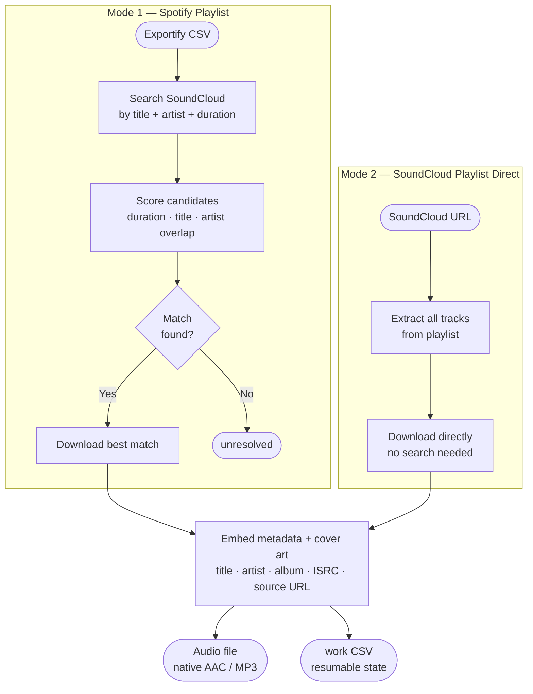

# cratedigg

> Source your Spotify playlists from SoundCloud — higher quality, your library, your files.

**cratedigg** is named after *crate digging* — the DJ practice of hunting through record crates for rare, high-quality tracks. The tool does the same thing digitally: takes your Spotify playlist and finds the best available version of each track on SoundCloud, preserving native audio quality instead of settling for a YouTube re-encode.

cratedigg takes an Exportify CSV (your Spotify playlist) and downloads each track from SoundCloud instead of YouTube Music. With SoundCloud Go+, you get 256kbps AAC or the artist's original upload. It can also download SoundCloud playlists and sets directly without any Spotify CSV at all.

> **SoundCloud Go+ is strongly recommended.** Without it, SoundCloud serves 128kbps MP3 — no better than a YouTube rip. Go+ unlocks 256kbps AAC and original-quality uploads. See [SoundCloud Go+](https://soundcloud.com/go).

---

## How It Works

Two input modes, one download engine:



**Key behaviors:**
- **Native quality by default** — preserves the SoundCloud stream format (AAC with Go+). `--mp3` transcodes to 320kbps MP3 if you need it.
- **Resumable** — every row's state is written to a `_work.csv`. Interrupted runs pick up exactly where they left off.
- **Serial by default** — runs one track at a time (`--workers 1`) to avoid SoundCloud 429 rate limits. Use `--workers 2` only if you're not hitting rate limits.
- **Source URL embedded** — the SoundCloud track link is written into the audio file's `WOAS` ID3 tag and the work CSV `source_url` column.

---

## Quick Start

**Prerequisites:** Python 3.10+, ffmpeg on PATH (see below), [SoundCloud Go+](https://soundcloud.com/go) subscription

```powershell
# 1. Install dependencies
pip install -r requirements.txt

# 2. Install ffmpeg (Windows — one-time)
Invoke-WebRequest -Uri "https://github.com/yt-dlp/FFmpeg-Builds/releases/download/latest/ffmpeg-master-latest-win64-gpl.zip" -OutFile "$env:TEMP\ffmpeg.zip"
Expand-Archive "$env:TEMP\ffmpeg.zip" -DestinationPath "$env:TEMP\ffmpeg"
Copy-Item (Get-ChildItem "$env:TEMP\ffmpeg" -Recurse -Filter "ffmpeg.exe" | Select -First 1).FullName -Destination "."
Copy-Item (Get-ChildItem "$env:TEMP\ffmpeg" -Recurse -Filter "ffprobe.exe" | Select -First 1).FullName -Destination "."

# 3. Export your Spotify playlist (see below), then run
python main.py my_playlist.csv
```

---

## Getting Your Spotify CSV

cratedigg uses [Exportify](https://exportify.app) to get your Spotify playlist data.

1. Go to **[exportify.app](https://exportify.app)**
2. Click **Log in with Spotify** and authorize the app
3. Your playlists appear as a list — find the one you want
4. Click **Export** next to it → a `.csv` file downloads automatically
5. Place the `.csv` file in the `input/` folder — cratedigg will find it automatically

> **Tip:** You can export multiple playlists and put them all in `input/`, then run `python main.py --csv-folder input/` to process them all in one go.

---

### Spotify playlist (via Exportify CSV)

```powershell
# Drop CSV in input/, then run from the cratedigg/ directory:
python main.py input/my_playlist.csv

# Best quality — unlock Go+ streams via browser cookies
python main.py input/my_playlist.csv --cookies-from-browser chrome

# Force MP3 output instead of native format
python main.py input/my_playlist.csv --mp3 --cookies-from-browser chrome

# Process all CSVs in the input/ folder at once
python main.py --csv-folder input/

# Preview matches without downloading (useful first pass)
python main.py input/my_playlist.csv --resolve-only
```

### SoundCloud playlist direct

```powershell
# Download a SoundCloud set or playlist
python main.py --sc-playlist "https://soundcloud.com/user/sets/my-set"

# Download all tracks from a user's page
python main.py --sc-playlist "https://soundcloud.com/username" --cookies-from-browser chrome

# Download your SoundCloud likes
python main.py --sc-playlist "https://soundcloud.com/username/likes" --cookies-from-browser chrome
```

### Resume and retry

```powershell
# Rerun — already-downloaded rows are skipped automatically
python main.py input/my_playlist.csv

# Force re-download everything
python main.py input/my_playlist.csv --force-redownload
```

---

## CLI Reference

### Input (pick one)

| Flag | Description |
|---|---|
| `csv PATH` | Path to a single Exportify CSV file — the playlist you want to download. |
| `--csv-folder DIR` | Path to a folder containing multiple Exportify CSVs. cratedigg processes every `.csv` in the folder in sequence, one playlist at a time. |
| `--sc-playlist URL` | A SoundCloud URL to download directly — a playlist, a set, or a user's full library. Skips Spotify entirely; no CSV needed. |

---

### Directories

| Flag | Default | Description |
|---|---|---|
| `--output-dir DIR` | `./output` | Where downloaded audio files land. cratedigg creates one subfolder per playlist inside this directory. Pass `D:\` to write directly to a USB drive — files go to `D:\my_playlist\`. |
| `--work-dir DIR` | `./work` | Where cratedigg keeps its internal `_work.csv` files. These track which tracks have been downloaded, which failed, and which are still pending. Don't edit these manually. |
| `--input-dir DIR` | `./input` | The folder cratedigg looks in when you use `--csv-folder` without specifying a path. Drop your Exportify CSVs here and run `--csv-folder` to process all of them. |

---

### Quality & Auth

| Flag | Default | Description |
|---|---|---|
| `--cookies-from-browser BROWSER` | — | Tells cratedigg to read your SoundCloud login session from your browser's local cookie store. SoundCloud uses this to confirm you're a Go+ subscriber, unlocking 256kbps AAC or original-upload quality instead of 128kbps MP3. Supported values: `chrome`, `firefox`, `edge`, `brave`. You must be logged into SoundCloud in that browser. |
| `--cookies-file FILE` | — | An alternative to `--cookies-from-browser`. Export your SoundCloud cookies to a Netscape-format `cookies.txt` file using a browser extension (e.g. "Get cookies.txt LOCALLY"), then pass the file path here. Useful if browser extraction doesn't work on your system. |
| `--mp3` | off | Forces all downloads to be transcoded to MP3 at 320kbps, regardless of what format SoundCloud provides. By default cratedigg keeps the native format — AAC (`.m4a`) with Go+, which is higher quality than MP3 at the same bitrate. Only use `--mp3` if your software or hardware requires it (e.g. some older DJ controllers). |

---

### Download Behaviour

| Flag | Default | Description |
|---|---|---|
| `--workers N` | `1` | How many tracks to download at the same time. SoundCloud rate-limits aggressively with concurrent requests — keep at `1` unless you're confident you won't hit 429 errors. |
| `--resolve-only` | off | Searches SoundCloud for matches and saves results to the work CSV, but does not download any audio. Useful as a first pass to preview what was found and what couldn't be matched before committing to a full download. |
| `--force-redownload` | off | Re-downloads every track, even ones already marked complete in the work CSV. Use this if you want to replace existing files (e.g. switching from free-tier quality to Go+). |
| `--limit N` | `0` (all) | Stops after downloading N tracks. Useful for testing that the tool is working before committing to a full playlist run. `0` means no limit — process everything. |

---

### Matching

| Flag | Default | Description |
|---|---|---|
| `--duration-tolerance SEC` | `10` | How many seconds of duration difference is allowed between the Spotify track and a SoundCloud result before cratedigg rejects the match. For example, a 3:45 Spotify track matched to a 3:52 SoundCloud result (7 seconds off) would pass with the default of 10. Raise this if legitimate matches are being missed; lower it if you're getting wrong tracks. |
| `--search-results N` | `6` | How many SoundCloud search results cratedigg scores per track before picking the best one. More candidates means a better chance of finding obscure tracks, but each extra candidate costs a small amount of time. `6` is a good balance. |
| `--id-order` | `priority` | Controls which tracks are processed first. `priority` handles new tracks before retrying failed ones — good for resuming interrupted runs. `ascending` and `descending` go by row number. `default` follows the original CSV order. |

---

### Rate Limiting

These options help avoid getting temporarily blocked by SoundCloud for making too many requests too fast.

| Flag | Default | Description |
|---|---|---|
| `--sleep-requests SEC` | `2.0` | Pause (in seconds) between each request to SoundCloud. Raise this if you're still seeing 429 rate-limit errors; lower it only if you're confident SoundCloud won't throttle you. |
| `--sleep-interval SEC` | `0.0` | Minimum pause between finishing one download and starting the next. Set to a positive value (e.g. `2.0`) if SoundCloud starts throttling individual downloads. |
| `--max-sleep-interval SEC` | `0.0` | When set above `--sleep-interval`, cratedigg picks a random wait time between the two values. This randomness makes the download pattern look less like a bot to SoundCloud's servers. |
| `--limit-rate RATE` | — | Caps how fast each file downloads. For example, `4M` limits to 4 MB/s. Useful if you're on a shared connection and don't want cratedigg to saturate your bandwidth. |
| `--throttled-rate RATE` | — | If SoundCloud detects a download and throttles it below this threshold (e.g. `50K`), yt-dlp will abort and retry. Helps avoid silently downloading at degraded speeds. |

---

## Output Structure

```
DJ/cratedigg/
├── input/
│   └── my_playlist.csv          ← drop Exportify CSVs here
│
├── output/
│   └── my_playlist/             ← audio files, one folder per playlist
│       ├── 0001 - Artist - Track.m4a
│       ├── 0002 - Artist - Track.m4a
│       └── ...
│
└── work/
    └── my_playlist_work.csv     ← auto-managed state (don't edit)

# SC playlist direct mode:
└── work/
    └── username_sets_my-set_work.csv
└── output/
    └── username_sets_my-set/
        └── 0001 - Artist - Track.m4a
```

The `_work.csv` file is your resumable state. It tracks:

| Column | What it stores |
|---|---|
| `download_status` | Current row state (see below) |
| `source_url` | SoundCloud track URL used for the download |
| `matched_title` | Title of the SoundCloud track that was matched |
| `duration_delta_s` | Seconds difference between Spotify and SoundCloud duration |
| `output_file` | Absolute path to the downloaded file |
| `output_format` | Container format: `m4a`, `mp3`, `opus`, etc. |
| `error_message` | Human-readable failure reason if something went wrong |

---

## Row Status Reference

| Status | Symbol | Meaning | Action |
|---|---|---|---|
| `downloaded` | ✓ | File on disk, complete | — |
| `resolved` | → | SC match saved, download pending | Rerun without `--resolve-only` |
| `unresolved` | ? | No SC match within duration tolerance | Try `--duration-tolerance 20` |
| `error` | ✗ | Permanent failure | Check `error_message` column |
| `retry` | ! | Hit rate limit | Rerun later — row is automatically retried |

---

## SoundCloud Go+ Quality

With Go+, SoundCloud delivers **256kbps AAC** or the **original uploaded file** on tracks where the artist enabled it — significantly better than the 128kbps MP3 you get without a subscription.

To unlock Go+ streams, pass your browser's SoundCloud session cookies:

```powershell
python main.py my_playlist.csv --cookies-from-browser chrome
```

Your browser must be open and logged into SoundCloud with an active Go+ subscription. The `--cookies-from-browser` flag works with `chrome`, `firefox`, `edge`, and `brave`.

> **Note:** Even with Go+, not every track exposes an original-quality stream — it depends on what the artist uploaded. The tool always selects the best available format.

---

## Audio Quality Reference

Understanding the quality difference between sources helps you decide when the YouTube fallback is acceptable and when it isn't.

### Source Comparison

| Source | Format | Bitrate | Notes |
|---|---|---|---|
| **SoundCloud Go+** | AAC (.m4a) | 256kbps | Or original upload — could be lossless WAV/FLAC |
| SoundCloud free | MP3 | 128kbps | Noticeably degraded at high volume |
| YouTube (free) | AAC / Opus | 128–160kbps | Varies by upload; often a transcode of a transcode |
| YouTube Premium | AAC | Up to 256kbps | Rare to actually reach this ceiling |

### What the Numbers Mean for DJing

- **128kbps** — audible compression artifacts on kick drums and hi-hats when played loud through a PA. Most experienced ears can hear the difference on a decent system.
- **256kbps AAC** — effectively transparent to most listeners. AAC is a more efficient codec than MP3, so 256kbps AAC sounds roughly equivalent to MP3 at 320kbps.
- **Original upload** (Go+, some tracks) — best case. Some artists upload WAV or FLAC directly to SoundCloud. You get exactly what they uploaded, with no lossy compression at all.

### AAC vs MP3 — What's the Difference?

Both are **lossy** formats — they discard audio information the codec deems inaudible to save space. The difference is in *how efficiently* they do it:

**MP3** (1993) is the older standard. At 128kbps it sounds noticeably compressed — smeared stereo image, artifacts on transients. At 320kbps it's good but still technically lossy.

**AAC** (1997) uses a more modern compression algorithm. It achieves the same perceived quality as MP3 at a lower bitrate — 256kbps AAC is generally considered audibly equivalent to 320kbps MP3. AAC is the native format for Apple devices, SoundCloud Go+, YouTube, and most streaming services.

**For DJing specifically:** the format that matters most is what you're playing on. Rekordbox, Serato, and Traktor all handle both natively. If your DJ controller or CDJ reads from a USB drive, check whether it supports `.m4a` (AAC) — most Pioneer hardware does, but some older gear only reads MP3.

### The YouTube Fallback Tradeoff

The YouTube fallback exists for tracks that are genuinely unavailable on SoundCloud (DRM, deleted, private). YouTube quality is usually acceptable but has two extra risks:

1. **Double transcode** — many YouTube uploads were already compressed before upload, so you're downloading a compressed version of a compressed file.
2. **Wrong version** — YouTube search results are less precise than SoundCloud. The fallback may find a live recording, remix, or cover instead of the studio version.

After a run, check the `output_format` column in your work CSV and audit any `[yt]` entries before adding them to a high-stakes set.

---


1. Download your playlist with cratedigg
2. In Rekordbox: **File → Add Folder to Collection**
3. Point it at the playlist folder (e.g. `D:\my_playlist\`)
4. Rekordbox reads the embedded metadata (title, artist, album, BPM after analysis)

Native AAC (`.m4a`) and MP3 are both fully supported by Rekordbox.

